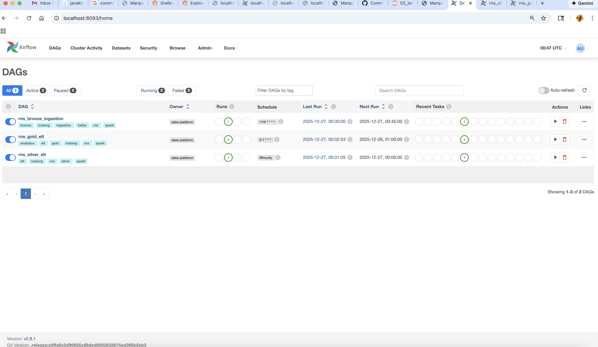
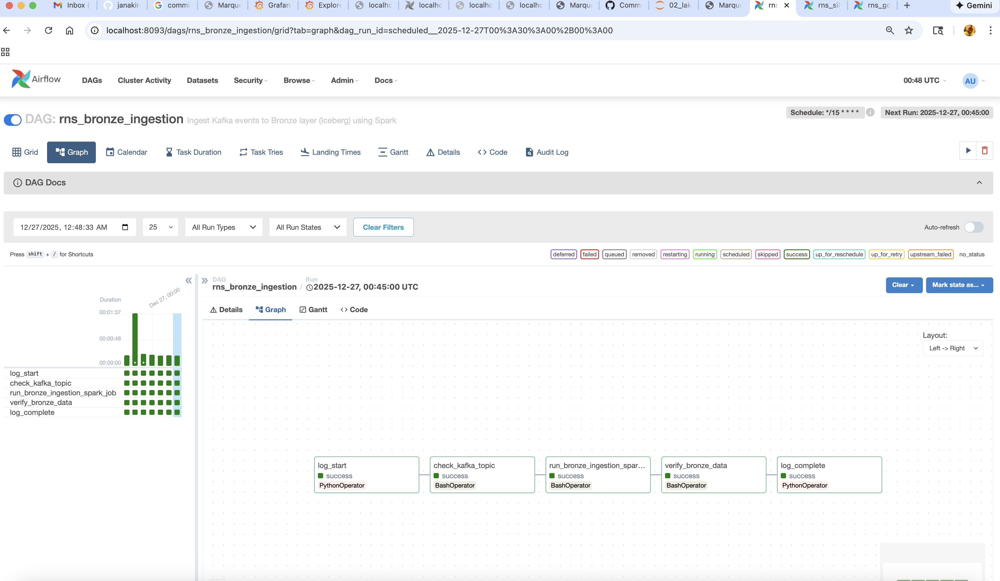
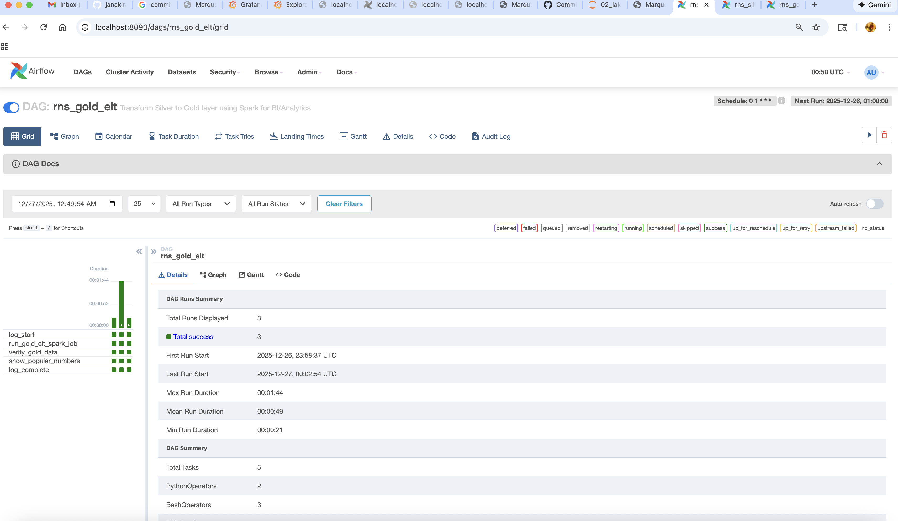
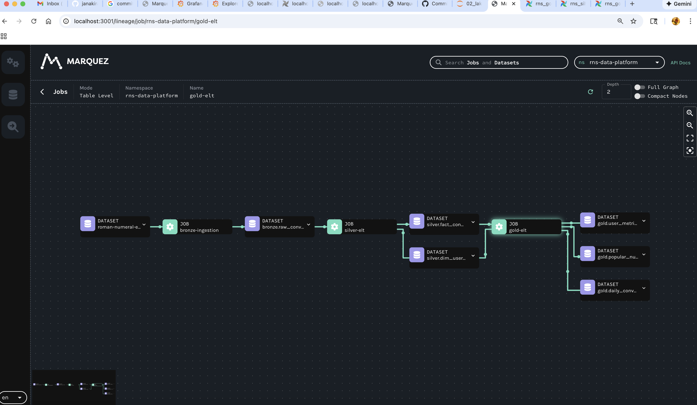
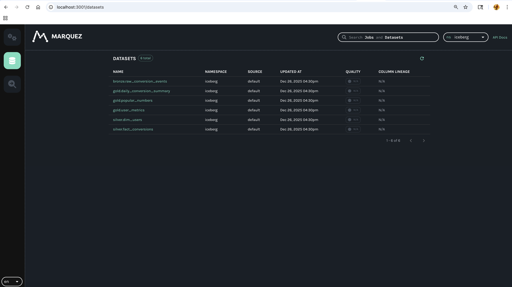
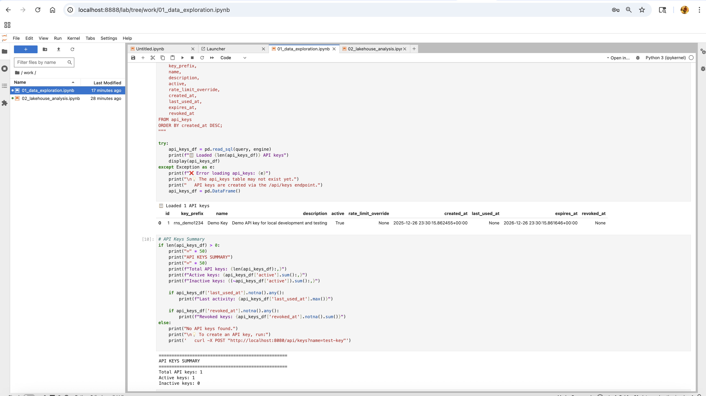
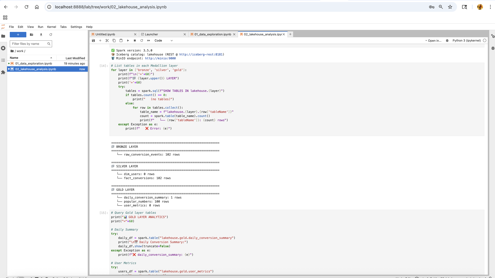
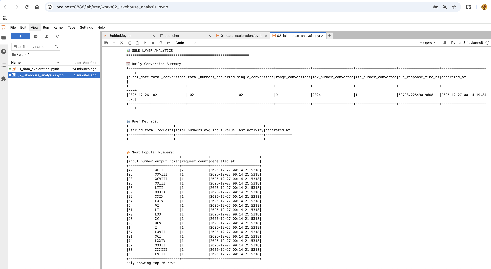
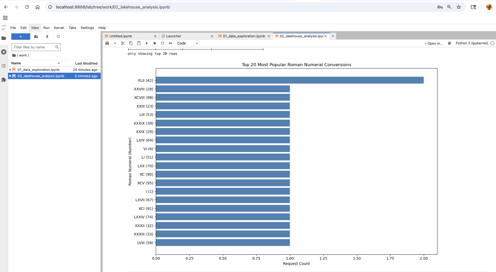
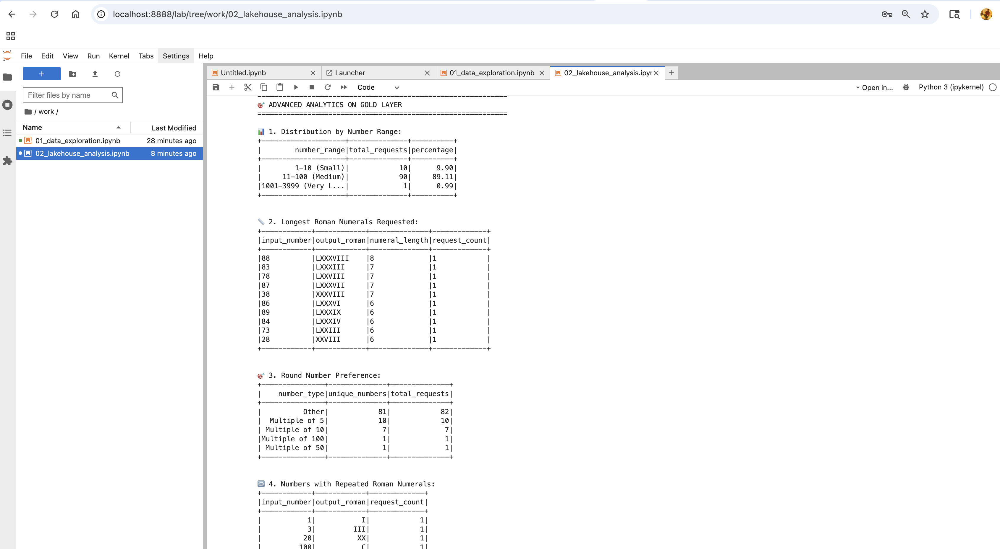

# Data Platform

This directory contains the data engineering components for the Roman Numeral Service's Unified Lakehouse Architecture.

> **See also:** [Main README](../README.md) | [Quick Start Guide](../QUICKSTART.md)

## Current Data Flow (Working)

```
┌─────────────────────────────────────────────────────────────────────────────┐
│                     PRODUCTION DATA PIPELINE                                 │
├─────────────────────────────────────────────────────────────────────────────┤
│                                                                             │
│   API Request                                                               │
│       │                                                                     │
│       ▼                                                                     │
│   ┌─────────┐     ┌─────────────┐     ┌─────────────┐     ┌─────────────┐  │
│   │  Kafka  │────▶│ Spark Bronze│────▶│ Spark Silver│────▶│ Spark Gold  │  │
│   │ Events  │     │  Ingestion  │     │    ELT      │     │    ELT      │  │
│   └─────────┘     └─────────────┘     └─────────────┘     └─────────────┘  │
│                          │                   │                   │          │
│                          ▼                   ▼                   ▼          │
│                   ┌─────────────────────────────────────────────────────┐   │
│                   │              ICEBERG LAKEHOUSE (MinIO)              │   │
│                   │   bronze.raw_events → silver.fact/dim → gold.agg   │   │
│                   └─────────────────────────────────────────────────────┘   │
│                                              │                              │
│                                              ▼                              │
│                                      ┌─────────────┐                        │
│                                      │   Jupyter   │                        │
│                                      │  Analytics  │                        │
│                                      └─────────────┘                        │
│                                                                             │
│   Orchestration: Airflow           Lineage: Marquez                         │
│   Storage: MinIO (S3)              Catalog: Iceberg REST                    │
│                                                                             │
└─────────────────────────────────────────────────────────────────────────────┘
```

## Flink (Streaming Demo)

Flink is included as a **streaming capability demonstration** for future enhancement. The Flink job code is production-ready but is **not actively feeding Iceberg tables** in this demo.

```
┌──────────────────────────────────────────────────────────────────────┐
│                    FLINK STREAMING (Future Enhancement)              │
│                                                                      │
│     Kafka  ────▶  Flink Job  ────▶  Console (demo) / Iceberg (prod) │
│                   │                                                  │
│                   ├─ Watermarks (5 min delay)                       │
│                   ├─ Deduplication (event_id, 24hr TTL)             │
│                   ├─ Late arrival handling (1 hr window)            │
│                   └─ Exactly-once (checkpoints + RocksDB)           │
│                                                                      │
│   Status: Demo only | UI: http://localhost:8092                     │
└──────────────────────────────────────────────────────────────────────┘
```

To enable Flink → Iceberg in production, see [ADR-013](../docs/adr/013-processing-engine-selection.md).

---

## Screenshots

### Airflow - DAG List

All pipelines enabled and ready:



### Airflow - DAG Graph View

Task dependencies visualization:



### Airflow - Successful Runs

Pipeline execution history:



### Marquez - Data Lineage

End-to-end data flow from Bronze → Silver → Gold:



### Marquez - Datasets

Tracked datasets in the lakehouse:



### Jupyter - Data Exploration (Notebook 01)

PostgreSQL exploration and API keys analysis:



### Jupyter - Lakehouse Analysis (Notebook 02)

**Bronze/Silver/Gold Layer Counts:**



**Sample Data Preview:**



**Gold Layer Analytics:**





---

## Directory Structure

```
data-platform/
├── README.md                           # This file
├── flink/
│   ├── conf/
│   │   └── flink-conf.yaml            # Flink configuration (checkpoints, S3)
│   └── bronze-ingestion/              # Java Flink project
│       ├── pom.xml                    # Maven build file
│       └── src/main/java/com/adobe/lakehouse/bronze/
│           ├── model/
│           │   ├── ConversionEvent.java   # Input event POJO
│           │   └── BronzeRecord.java      # Output record POJO
│           ├── function/
│           │   └── DeduplicationFunction.java  # Keyed state dedup
│           └── job/
│               └── BronzeIngestionJob.java     # Main job class
├── spark/
│   ├── conf/
│   │   └── spark-defaults.conf        # Spark configuration for Iceberg/S3
│   └── jobs/
│       ├── silver_elt.py              # Bronze → Silver transformations
│       └── gold_elt.py                # Silver → Gold aggregations
├── airflow/
│   └── dags/
│       ├── rns_bronze_ingestion.py    # Kafka → Bronze (Spark batch)
│       ├── rns_silver_elt.py          # Bronze → Silver ELT
│       └── rns_gold_elt.py            # Silver → Gold ELT
└── notebooks/                         # Jupyter analysis notebooks
```

## Data Engineering Standards

### 1. Exactly-Once Semantics
```
Flink: Checkpoints + RocksDB state backend + Kafka offsets
Spark: Iceberg ACID transactions + Idempotent writes
```

### 2. Late Arriving Data
```
Flink: Watermark = event_time - 5 minutes
       Allowed lateness = 1 hour
       Late events flagged (is_late_arrival = true)
```

### 3. Deduplication
```
Bronze (Flink): Keyed state by event_id, 24-hour TTL
Silver (Spark): MERGE INTO with event_id as key
```

### 4. Error Handling
```
Dead Letter Queue: roman-numeral-events-dlq (Kafka topic)
Error metadata: original_payload, error_type, error_message, failed_at
```

### 5. Backfill Strategy
```
Spark: Parameterized date ranges
       Write to staging table, validate, then swap
       Maintain audit trail in _audit columns
```

### 6. Failure Recovery
```
Flink: Auto-restart (3 attempts, 30s delay)
       Checkpoint-based state recovery
       Savepoints for planned upgrades
       
Spark: Airflow retry policy
       Idempotent batch writes (safe to re-run)
```

## Running Jobs

### Flink Bronze Streaming (Real-time)

```bash
# Build the Flink job JAR (from host)
cd data-platform/flink/bronze-ingestion
mvn clean package -DskipTests

# Connect to Flink JobManager
docker exec -it flink-jobmanager bash

# Submit the streaming job
flink run \
  -c com.adobe.lakehouse.bronze.job.BronzeIngestionJob \
  /opt/flink-jobs/bronze-ingestion/target/bronze-ingestion-1.0.0.jar

# View running jobs
flink list

# Cancel a job
flink cancel <job-id>

# Create savepoint (for upgrades)
flink savepoint <job-id> s3://lakehouse/flink/savepoints
```

### Spark Silver/Gold Batch (via Airflow)

```bash
# Manual execution for testing
docker exec -it spark-master bash

# Run Silver ELT
spark-submit \
  --master spark://spark-master:7077 \
  --packages org.apache.iceberg:iceberg-spark-runtime-3.5_2.12:1.4.2,\
org.apache.hadoop:hadoop-aws:3.3.4 \
  /opt/spark-jobs/silver_elt.py \
  --date 2024-12-25

# Run Gold ELT
spark-submit \
  --master spark://spark-master:7077 \
  /opt/spark-jobs/gold_elt.py \
  --date 2024-12-25
```

## Medallion Architecture Layers

| Layer | Engine | Purpose | Update Frequency |
|-------|--------|---------|------------------|
| **Bronze** | Spark (batch) | Raw event landing from Kafka | On-demand / Scheduled |
| **Silver** | Spark (batch) | Cleaned, validated, SCD Type 2 | Hourly |
| **Gold** | Spark (batch) | Star schema, aggregates | Daily |

### Bronze Layer (Spark)
- Batch ingestion from Kafka topic
- Append-only raw events
- Partitioned by event date
- No transformations

### Silver Layer (Spark)
- Deduplicated and validated
- SCD Type 2 for `dim_users`
- Entity-focused schema
- Incremental updates

### Gold Layer (Spark)
- Star schema for BI
- Pre-aggregated metrics
- Optimized for analytics queries
- Daily refresh

## Testing the Data Platform

### Step 1: Generate Test Data

```bash
# Generate 100 API requests to create Kafka events
for i in {1..100}; do
  curl -s "http://localhost:8080/romannumeral?query=$((RANDOM % 3999 + 1))" > /dev/null
done
echo "Generated 100 events"

# Verify events in Kafka
docker exec kafka /opt/kafka/bin/kafka-console-consumer.sh \
  --bootstrap-server localhost:9092 \
  --topic roman-numeral-events \
  --from-beginning --max-messages 5
```

### Step 2: Test Airflow Pipelines

1. **Open Airflow UI**: http://localhost:8093 (admin/admin)
2. **Enable all DAGs** (toggle switches to ON):
   - `rns_bronze_ingestion` - Kafka → Bronze
   - `rns_silver_elt` - Bronze → Silver
   - `rns_gold_elt` - Silver → Gold
3. **Trigger DAGs in order** (click play button):
   - First: `rns_bronze_ingestion`
   - Wait for completion (green), then: `rns_silver_elt`
   - Wait for completion (green), then: `rns_gold_elt`

Or trigger via CLI:
```bash
docker exec -u airflow airflow airflow dags trigger rns_bronze_ingestion
# Wait 1-2 minutes
docker exec -u airflow airflow airflow dags trigger rns_silver_elt
# Wait 1-2 minutes
docker exec -u airflow airflow airflow dags trigger rns_gold_elt
```

### Step 3: Verify Data in Jupyter

1. **Open Jupyter**: http://localhost:8888 (token: `jupyter`)
2. **Navigate to**: `work/02_lakehouse_analysis.ipynb`
3. **Run all cells** - you should see:
   - Bronze layer: `raw_conversion_events` with row count
   - Silver layer: `fact_conversions`, `dim_users`
   - Gold layer: `popular_numbers`, `daily_conversion_summary`, `user_metrics`

### Step 4: View Data Lineage in Marquez

1. **Open Marquez UI**: http://localhost:3001
2. **Select namespace**: `rns-data-platform`
3. **View lineage graph**: Click on any job (e.g., `gold-elt`) to see full lineage

### Quick Verification Commands

```bash
# Check Airflow DAG status
docker exec -u airflow airflow airflow dags list

# Check Bronze table row count (via Spark)
docker exec spark-master spark-sql \
  --conf spark.sql.catalog.lakehouse=org.apache.iceberg.spark.SparkCatalog \
  --conf spark.sql.catalog.lakehouse.type=rest \
  --conf spark.sql.catalog.lakehouse.uri=http://iceberg-rest:8181 \
  -e "SELECT COUNT(*) FROM lakehouse.bronze.raw_conversion_events"

# Check Marquez datasets
curl -s http://localhost:5050/api/v1/namespaces/rns-data-platform/datasets | jq '.datasets[].name'
```

---

## Data Lineage (Marquez)

**Demo:** Lineage is seeded via `docker/marquez/init-lineage.sh` on startup.

**Production:** Use [OpenLineage](https://openlineage.io) integrations:
- Spark: Add `openlineage-spark` JAR with `OpenLineageSparkListener`
- Airflow: Install `apache-airflow-providers-openlineage`

> **Note:** `airflow/dags/common/openlineage_config.py` provides utilities for
> production integration but is not actively used in this demo.

### Viewing Lineage
- **Marquez UI**: http://localhost:3001
- **Namespace**: `rns-data-platform`

---

## Monitoring

### Flink UI
- **URL**: http://localhost:8092
- **Metrics**: Jobs, tasks, checkpoints, backpressure
- **Alerts**: Failed checkpoints, task failures

### Spark UI
- **Master**: http://localhost:8090
- **Worker**: http://localhost:8091
- **Metrics**: Applications, stages, executors

### Kafka Monitoring

```bash
# List topics
docker exec kafka kafka-topics.sh --list --bootstrap-server localhost:9092

# View Bronze ingestion consumer lag
docker exec kafka kafka-consumer-groups.sh \
  --bootstrap-server localhost:9092 \
  --describe --group flink-bronze-ingestion

# View Dead Letter Queue
docker exec kafka kafka-console-consumer.sh \
  --bootstrap-server localhost:9092 \
  --topic roman-numeral-events-dlq \
  --from-beginning
```

## Troubleshooting

### Flink Job Fails to Start
```bash
# Check JobManager logs
docker logs flink-jobmanager

# Verify Kafka connectivity
docker exec flink-taskmanager nc -zv kafka 9092

# Check MinIO (S3) for checkpoint access
docker exec flink-jobmanager curl http://minio:9000
```

### Checkpoint Failures
```bash
# Verify MinIO bucket exists
docker exec minio mc ls myminio/lakehouse/flink/checkpoints

# Check Flink configuration
docker exec flink-jobmanager cat /opt/flink/conf/flink-conf.yaml
```

### Spark Job Fails
```bash
# Check Spark Master logs
docker logs spark-master

# Verify Hive Metastore connectivity
docker exec spark-master nc -zv hive-metastore 9083

# Check Iceberg table
docker exec -it spark-master spark-sql \
  --conf spark.sql.catalog.lakehouse=org.apache.iceberg.spark.SparkCatalog \
  -e "SHOW TABLES IN lakehouse.bronze"
```

## Configuration Files

### Flink (`flink/conf/flink-conf.yaml`)
- Checkpoint interval: 60 seconds
- State backend: RocksDB (incremental)
- Restart strategy: 3 attempts, 30s delay
- S3 endpoint: MinIO

### Spark (`spark/conf/spark-defaults.conf`)
- Iceberg catalog: Hive Metastore
- S3 endpoint: MinIO
- File format: Parquet with Snappy
